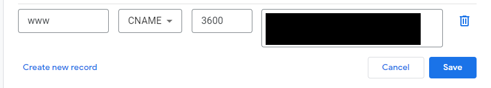
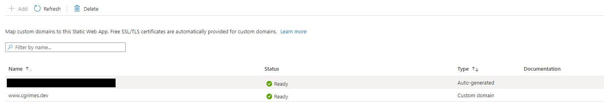

When you first create an [Azure Static Web App](https://azure.microsoft.com/en-gb/services/app-service/static/) you get a randomly generated domain - this is the URL for your site and is the domain you will see in the Overview page for your application when viewed in Azure. Unless you are planning on leaving your application as a test site it is quite likely that you will want to add your own domain(s) at some point. The good news is that even the Free tier for Azure Static Web Apps includes 2 custom domains, and you can get 5 with the Standard pricing tier - with both including SSL certificates.

You can purchase a domain through Azure App Service Domains or you can use a domain from another registrar. Azure App Service Domains work really well with Azure Static Web Apps but at this time you are limited to .com, .net, .org, .nl, .in, .biz, .org.uk and .co.in - so you will need to go elsewhere if you want a domain other than these. Luckily it is fairly easy to setup custom domains from any registrar.

I had a [Google Domains](https://domains.google/) domain that I wanted to use with my Azure Static Web App. The documentation for setting up a custom domain in Azure is good - [Set up a custom domain with free certificate in Azure Static Web Apps](https://docs.microsoft.com/en-us/azure/static-web-apps/custom-domain?tabs=azure-dns), the only problem is that Google Domains does not let you create an ALIAS record and so you can't actually follow these instructions all the way through.

At a high level, if you are able to use ALIAS records and can therefore follow the documentation mentioned above then you will go through the following steps:

1. Setup your www subdomain in Azure
2. Validate subdomain ownership by setting up a CNAME record with your registrar
3. Setup your root domain in Azure
4. Validate root domain ownership by setting up a TXT record with your registrar
5. Add an ALIAS record for your root domain with your registrar to allow for root domain resolution

If you can't use ALIAS records, as is the case with Google Domains, then you can essentially replace steps 3-5 with domain forwarding. The below assumes that the domain isn't in use and all we want to do is set up the www subdomain and the root - so for this blog site that would involve setting up www.cgrimes.dev and cgrimes.dev. There are only 2 high level steps you need to go through to get everything working:

1. [Setup your www subdomain](#setup-your-www-subdomain)
3. [Setup domain forwarding](#setup-domain-forwarding)

## Setup your www subdomain

The first thing we want to do is to setup the www subdomain. These steps are identical to the Azure docs [Set up a custom domain with free certificate in Azure Static Web Apps](https://docs.microsoft.com/en-us/azure/static-web-apps/custom-domain?tabs=azure-dns), so you can follow this if you want to. I'm going to use www.cgrimes.dev as the example here.

Broadly what we are doing here is setting up a CNAME record to map www.cgrimes.dev to the Azure Static Web App auto-generated domain. At the end of this section you should be able to go to your www subdomain (www.cgrimes.dev) and it will resolve to your Azure Static Web App.

### Azure Static Web App

1. Go to your static web app in Azure
2. Go the Custom domains option under Settings
3. You should at this stage just see the auto-generated Azure given domain
4. Click Add and then enter your domain name with the subdomain www, so in my case www.cgrimes.dev
5. Click Next and you should be on the Validate + Configure window
6. At this stage we essentially need to prove to Azure that we own the domain we are trying to use
7. Double check the Domain name on this page and make sure the Hostname record type is set to CNAME
8. At this stage it is now showing the CNAME details that you need to add at Google Domains
9. Copy to your clipboard the Value that is shown for the CNAME record - the auto-generated domain for your app

### Google Domains

1. Log into your Google Domains account, go to My domains and click Manage on the domain you want to use
2. Go to DNS in the left hand option
3. Expand the Custom records section and click Manage custom records
4. Click Create new record and then enter the following
    * Host name = www
    * Type = CNAME
    * TTL = Leave at default of 3600
    * Data = This should be the auto-generated domain name for your app, it should still be on your clipboard
5. Save this change

### Back to Azure Static Web App

1. You should still be on the Validation + Configure page so click the Add button
2. It might end up stuck on Adding for some time as it relies on the DNS change you made in your Google Domains account propogating
3. You don't need to keep this window open but can close it and in the Custom domains section you will be able to see the status is Adding...
4. Eventually everything will resolve and the status will change to Ready

## Setup domain forwarding

This is the part where we need to deviate from the docs. Instead of validating the root domain ownership and using ALIAS records we simply use domain forwarding instead, so  that cgrimes.dev is forwarded to www.cgrimes.dev. This is something that people often do anyway when choosing what their default domain is - www vs non-www. In this instance we are going with www as our default and we can set it up so that the paths and SSL are retained. This should lead to a seamless experience and also not negatively impact SEO.

### Google Domains

1. Go back to the DNS options for your site in Google Domains
2. Expand the Domain forward section and select Manage
3. Enter the following information
    * Forward to = www.cgrimes.dev
    * From = cgrimes.dev
    * Redirect type = Permanent redirect (301)
    * Path forwarding = forward path
    * SSL = On
4. Save these changes

Once all these changes propogate, you should now have your root and www subomdains directed to your Azure Static Web App.
